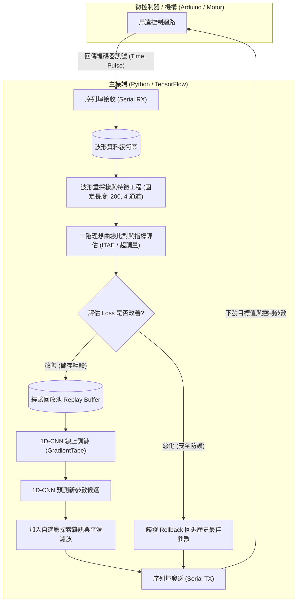
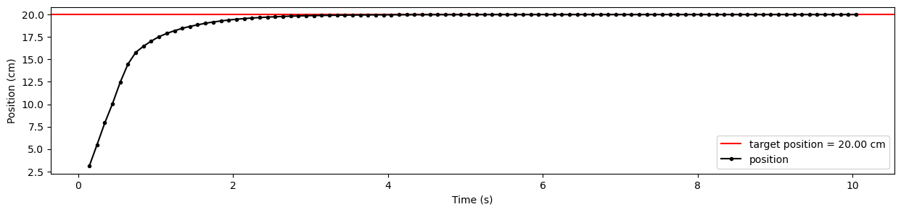
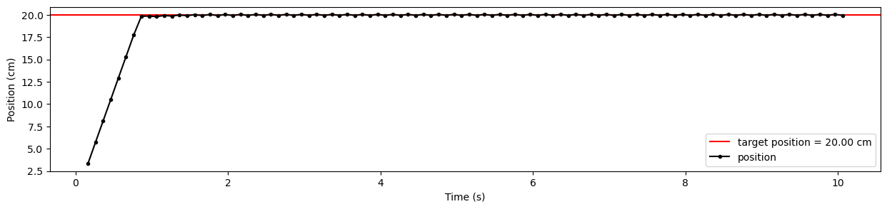
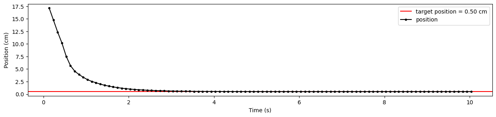
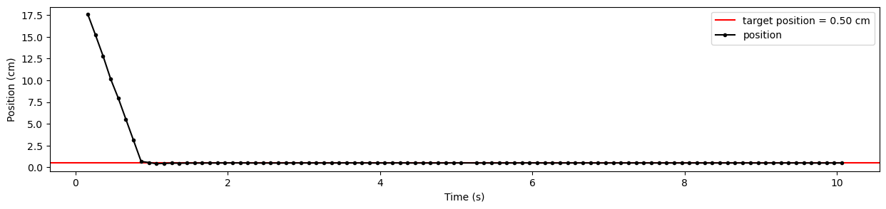
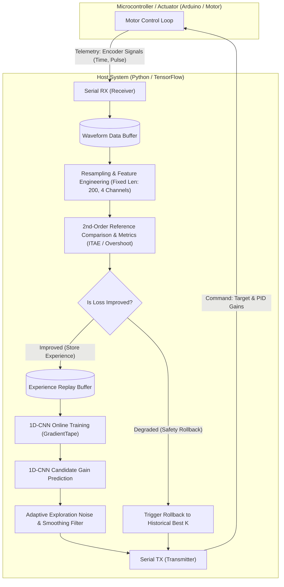

[ 繁體中文 ](#adaptive-pid-cnn-基於-1d-cnn-與波形評估之自適應-pid-參數優化系統) | [ English ](#adaptive-pid-cnn-adaptive-pid-parameter-optimization-system-based-on-1d-cnn-and-waveform-evaluation)

---

# Adaptive-PID-CNN: 基於 1D-CNN 與波形評估之自適應 PID 參數優化系統

[-orange.svg)](https://github.com)

> **專案狀態說明**：本專案目前為 **進行中半成品（Work in Progress）**，核心線上即時學習架構、通訊協定與 1D-CNN 特徵評估模型已實作完成，正持續驗證與調優收斂穩定性。

---

## 專案簡介 (Overview)

在傳統電機或致動器控制系統中，PID 控制器參數（如 $K_{pp}, K_{pd}, K_{vp}, K_{vi}$）通常依賴工程師手動經驗整定（如 Ziegler-Nichols 法）或靜態系統辨識，面對非線性摩擦力、負載變動或機構間隙時難以兼顧響應速度與穩定性。

本專案結合**經典控制理論（Classical Control Theory）**與**深度學習時序特徵提取（1D-CNN）**，建立了一套 **硬體在環（Hardware-in-the-Loop, HIL）** 的線上自適應 PID 參數學習系統：
1. **即時收集響應波形**：透過序列埠（UART）與 Arduino/微控制器即時雙向通訊。
2. **多維控制品質評估**：對比二階系統理想響應曲線，融合 **Tracking Error**、**ITAE（時間絕對誤差積分）** 與 **超調量（Overshoot）**。
3. **1D-CNN 參數預測與經驗回放**：提取響應時序特徵推薦最佳 $K$ 參數，並具備自適應探索雜訊與**故障回滾（Rollback）**機制。

---

## 系統技術機制與運作原理 (System Mechanisms & Principles)

本系統透過閉迴路線上自適應機制進行參數整定，各模組之運作邏輯如下：

- **時序特徵提取 (1D-CNN Feature Extraction)**：
  - 將硬體採樣之動態波形標準化並重採樣為固定長度時序向量（包含標準化時間、目標位移、實際位置與即時誤差 4 通道特徵）。
  - 利用 1D 卷積層捕捉系統暫態響應關鍵指標（如上升時間、震盪衰減頻率與穩態誤差趨勢）。
- **物理系統引導之綜合評估指標 (Physics-guided Loss)**：
  - 以標準二階系統臨界阻尼／欠阻尼理想響應曲線作為 Reference 基準。
  - 多目標損失函數量化控制品質：$\text{Loss} = \text{NormTracking} + 0.4 \times \text{NormITAE} + 0.2 \times \text{Overshoot}$。
- **經驗回放與在線強化探索 (Experience Replay & Exploration)**：
  - 歷史最佳響應參數存入經驗池（Replay Buffer），以 Mini-batch 線上即時微調神經網路權重。
  - 動態縮放常態分佈雜訊半徑（Noise Scale），平衡利用（Exploitation）與探索（Exploration）的收斂步長。
- **硬體安全防護與異常復原 (Safety Guard & Rollback)**：
  - 透過**指數平滑（Exponential Smoothing）**過濾參數突變，防止機構產生劇烈高頻抖動。
  - 若新參數導致響應顯著劣化（Loss 暴增超過 1.3 倍），即刻啟動 **Rollback** 恢復歷史最佳穩定參數並收斂探索範圍。
- **非阻塞即時序列傳輸 (Real-time Asynchronous I/O)**：
  - 採用獨立的接收（Receive）與發送（Transmit）執行緒，確保高頻 UART 二進位資料封包收發不阻礙模型推論與梯度更新。

---

## 系統架構 (System Architecture)

---

## 實驗驗證與動態自適應變化 (Experimental Validation & Waveform Evolution)

透過實體硬體在環（HIL）即時閉迴路測試，系統在多輪控制指令迭代過程中展現顯著的動態調校與波形收斂變化：

### 1. 初始階段（第 1 ~ 2 輪迭代）
- **響應特性**：系統採用保守初始增益，動態響應較為遲緩（Sluggish Response）。
- **暫態指標**：
  - 目標由 0 cm 步階上升至 20 cm 時，上升時間（Rise Time）約需 2.5 秒才漸進收斂至設定值。
  - 回程由高位降至 0.5 cm 時，動態調節時間約需 3.5 秒。
- **評估與學習**：此階段雖具備近乎零超調特性，但 ITAE 積分誤差較大；波形特徵經 1D-CNN 評估後判定具改善潛力（`improved`），波形數據與參數寫入經驗池（Replay Buffer）並啟動初次權重訓練。

### 2. 線上探索與防護機制觸發過程
- 1D-CNN 模型持續根據回傳波形預測新參數，並附加動態衰減的探索雜訊（Noise Scale）。
- **安全回滾實測**：在探索週期中若因雜訊或非線性負載導致控制波形惡化（例如 Loss 異常升高），系統即刻判定 `not improved` 並觸發 **Rollback to best K**，保證機構硬體在探索過程中免於劇烈震盪或失控。

### 3. 優化收斂階段（第 19 ~ 20 輪迭代）
- **響應特性**：神經網路成功學習到適應當前負載與非線性摩擦的最佳 PID 參數組合。
- **暫態指標**：
  - 步階響應至 20 cm 的上升時間由原本 2.5 秒大幅縮短至 **約 0.8 秒**，動態剛性與響應速度提升約 **3 倍**。
  - 回程降至 0.5 cm 的定位調節時間由 3.5 秒大幅縮短至 **約 1.0 秒**。
  - 在維持高精度穩態定位且無顯著超調（Overshoot < 3%）的前提下，大幅消除系統遲滯效應。

### 性能變化對比

| 評估指標 | 初始階段 (Iteration 1 - 2) | 1D-CNN 優化後 (Iteration 19 - 20) | 變化幅度與改善效果 |
| :--- | :--- | :--- | :--- |
| **上升時間 (Rise Time to 20cm)** | ~ 2.5 秒 | **~ 0.8 秒** | 響應速度提升約 **3.1x** |
| **回程調節時間 (Settling Time to 0.5cm)** | ~ 3.5 秒 | **~ 1.0 秒** | 調節耗時縮短約 **71%** |
| **暫態超調量 (Overshoot)** | 0% | **< 3%** | 保持極低震盪與高穩定度 |
| **閉迴路調校行為** | 靜態保守參數 | **即時線上學習 + 異常防護回滾** | 兼顧快速探索與硬體安全 |

### 實測波形對比圖 (Waveform Comparison)

#### 步階上升響應 (Step-Up: 0 cm -> 20 cm)

| 初始響應 (Iteration 1: 上升時間 ~2.5s) | 1D-CNN 自適應優化後 (Iteration 19: 上升時間 ~0.8s) |
| :---: | :---: |
|  |  |

#### 回程定位響應 (Return Stroke: 20 cm -> 0.5 cm)

| 初始響應 (Iteration 2: 調節時間 ~3.5s) | 1D-CNN 自適應優化後 (Iteration 20: 調節時間 ~1.0s) |
| :---: | :---: |
|  |  |

---

# Adaptive-PID-CNN: Adaptive PID Parameter Optimization System Based on 1D-CNN and Waveform Evaluation

[-orange.svg)](https://github.com)

> **Project Status**: This project is currently a **Work in Progress (WIP)**. The core online real-time learning architecture, serial communication protocol, and 1D-CNN feature evaluation model have been implemented, with ongoing validation and tuning for convergence stability.

---

## Overview

In traditional motor and actuator control systems, PID controller gains (such as $K_{pp}, K_{pd}, K_{vp}, K_{vi}$) typically rely on manual empirical tuning (e.g., Ziegler-Nichols method) or static system identification. However, under non-linear friction, dynamic load variations, or mechanical backlash, conventional approaches struggle to balance response speed and stability simultaneously.

This project integrates **Classical Control Theory** with **deep learning temporal feature extraction (1D-CNN)** to establish an online adaptive PID gain-tuning system with **Hardware-in-the-Loop (HIL)** capabilities:
1. **Real-time Waveform Acquisition**: High-frequency bidirectional communication with Arduino/microcontroller via serial interface (UART).
2. **Multi-dimensional Control Quality Evaluation**: Compares dynamic responses against an idealized second-order reference model, incorporating **Tracking Error**, **ITAE (Integral of Time-weighted Absolute Error)**, and **Overshoot**.
3. **1D-CNN Gain Prediction & Experience Replay**: Extracts temporal dynamic features to recommend optimal $K$ parameters, coupled with adaptive exploration noise and an automated **Rollback** safety mechanism.

---

## System Mechanisms & Principles

The system tunes controller parameters via a closed-loop online adaptation pipeline consisting of the following modules:

- **Temporal Feature Extraction (1D-CNN Feature Extraction)**:
  - Standardizes and resamples sampled dynamic waveforms into fixed-length temporal vectors (4 input channels: normalized time, target position, actual position, and tracking error).
  - Utilizes 1D convolutional layers to extract key transient response metrics (e.g., rise time, oscillation decay frequency, and steady-state error trends).
- **Physics-Guided Multi-Objective Evaluation (Physics-guided Loss)**:
  - Employs critically damped / underdamped step responses of a standard second-order model as the reference baseline.
  - Evaluates control quality via a multi-objective loss function: $\text{Loss} = \text{NormTracking} + 0.4 \times \text{NormITAE} + 0.2 \times \text{Overshoot}$.
- **Online Experience Replay & Exploration (Experience Replay & Exploration)**:
  - Stores historical top-performing parameter trajectories in a Replay Buffer for real-time mini-batch gradient updates.
  - Dynamically scales Gaussian exploration noise to balance exploitation and exploration during convergence.
- **Hardware Safety Guard & Fault Recovery (Safety Guard & Rollback)**:
  - Applies **Exponential Smoothing** to prevent abrupt parameter leaps, suppressing severe high-frequency mechanical vibration.
  - If candidate parameters cause severe response degradation (loss surge exceeding 1.3x), an automatic **Rollback** triggers to restore the best historical parameters and restrict the exploration radius.
- **Non-blocking Real-time Serial Communication (Real-time Asynchronous I/O)**:
  - Employs dedicated Receive (RX) and Transmit (TX) threads, ensuring high-frequency UART binary packet transmission does not block model inference or gradient updates.

---

## System Architecture

---

## Experimental Validation & Waveform Evolution

Through real-time Hardware-in-the-Loop (HIL) closed-loop trials, the system demonstrated pronounced dynamic tuning and waveform convergence across multi-step control iterations:

### 1. Initial State (Iterations 1 - 2)
- **Response Characteristics**: Operating under conservative initial parameters, the actuator exhibited a sluggish dynamic response.
- **Transient Metrics**:
  - For a step command from 0 to 20 cm, the rise time required approximately 2.5 seconds to settle at the setpoint.
  - For the return stroke back to 0.5 cm, transient settling took approximately 3.5 seconds.
- **Evaluation & Learning**: Although overshoot was minimal, tracking delay produced a relatively large ITAE error. The 1D-CNN evaluated the waveform, flagged improvement potential (`improved`), registered the trajectory into the Replay Buffer, and initiated online backpropagation.

### 2. Online Exploration & Safety Guard Triggering
- The 1D-CNN iteratively inferred updated parameter candidates paired with dynamically scaled Gaussian exploration noise.
- **Rollback in Action**: When exploration perturbations or non-linear load disturbances induced suboptimal control quality, the system immediately identified the deviation (`not improved`) and triggered an automated **Rollback to best K**, effectively insulating the mechanical setup from violent oscillation or instability.

### 3. Convergence & Optimized State (Iterations 19 - 20)
- **Response Characteristics**: The neural network successfully mapped the optimal PID gain set tailored to the plant's load inertia and non-linear friction characteristics.
- **Transient Metrics**:
  - The step response rise time to 20 cm dropped sharply from 2.5s to **~0.8 seconds**, yielding a **~3x improvement in dynamic response speed**.
  - The return stroke settling time to 0.5 cm was compressed from 3.5s to **~1.0 seconds**.
  - High steady-state accuracy was preserved with negligible overshoot (< 3%), eliminating sluggish actuator lag while maintaining smooth motion profiles.

### Dynamic Performance Comparison

| Metric | Initial State (Iterations 1 - 2) | Optimized State (Iterations 19 - 20) | Evolution & Performance Gain |
| :--- | :--- | :--- | :--- |
| **Rise Time (to 20 cm)** | ~ 2.5 s | **~ 0.8 s** | **~ 3.1x faster** response |
| **Settling Time (to 0.5 cm)** | ~ 3.5 s | **~ 1.0 s** | **~ 71% reduction** in settling latency |
| **Transient Overshoot** | 0% | **< 3%** | High damping with minimal oscillation |
| **Closed-loop Mechanism** | Static conservative gains | **Online replay learning + Safety rollback** | Adaptive convergence with hardware protection |

### Experimental Waveform Comparison

#### Step-Up Response (0 cm -> 20 cm)

| Initial State (Iteration 1: Rise Time ~2.5s) | Optimized via 1D-CNN (Iteration 19: Rise Time ~0.8s) |
| :---: | :---: |
|  |  |

#### Return-Stroke Response (20 cm -> 0.5 cm)

| Initial State (Iteration 2: Settling Time ~3.5s) | Optimized via 1D-CNN (Iteration 20: Settling Time ~1.0s) |
| :---: | :---: |
|  |  |

