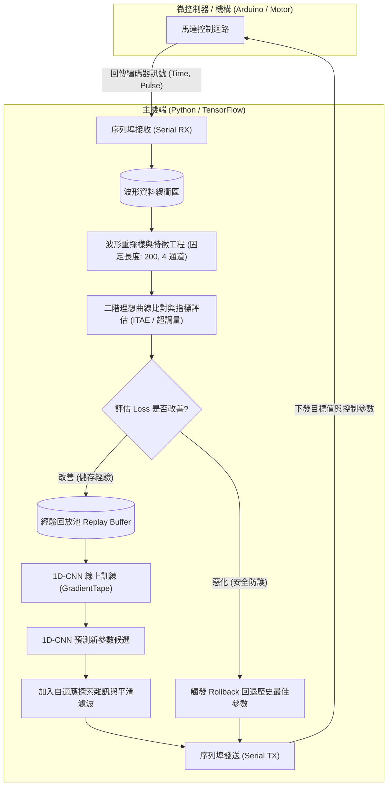

# Adaptive-PID-CNN: 基於 1D-CNN 與波形評估之自適應 PID 參數優化系統

[-orange.svg)](https://github.com)

> **專案狀態說明**：本專案目前為 **進行中半成品（Work in Progress）**，核心線上即時學習架構、通訊協定與 1D-CNN 特徵評估模型已實作完成，正持續驗證與調優收斂穩定性。

---

## 專案簡介 (Overview)

在傳統電機或致動器控制系統中，PID 控制器參數（如 $K_{pp}, K_{pd}, K_{vp}, K_{vi}$）通常依賴工程師手動經驗整定（如 Ziegler-Nichols 法）或靜態系統辨識，面對非線性摩擦力、負載變動或機構間隙時難以兼顧響應速度與穩定性。

本專案結合**經典控制理論（Classical Control Theory）**與**深度學習時序特徵提取（1D-CNN）**，建立了一套 **硬體在環（Hardware-in-the-Loop, HIL）** 的線上自適應 PID 參數學習系統：
1. **即時收集響應波形**：透過序列埠（UART）與 Arduino/微控制器即時雙向通訊。
2. **多維控制品質評估**：對比二階系統理想響應曲線，融合 **Tracking Error**、**ITAE（時間絕對誤差積分）** 與 **超調量（Overshoot）**。
3. **1D-CNN 參數預測與經驗回放**：提取響應時序特徵推薦最佳 $K$ 參數，並具備自適應探索雜訊與**故障回滾（Rollback）**機制。

---

## 系統技術機制與運作原理 (System Mechanisms & Principles)

本系統透過閉迴路線上自適應機制進行參數整定，各模組之運作邏輯如下：

- **時序特徵提取 (1D-CNN Feature Extraction)**：
  - 將硬體採樣之動態波形標準化並重採樣為固定長度時序向量（包含標準化時間、目標位移、實際位置與即時誤差 4 通道特徵）。
  - 利用 1D 卷積層捕捉系統暫態響應關鍵指標（如上升時間、震盪衰減頻率與穩態誤差趨勢）。
- **物理系統引導之綜合評估指標 (Physics-guided Loss)**：
  - 以標準二階系統臨界阻尼／欠阻尼理想響應曲線作為 Reference 基準。
  - 多目標損失函數量化控制品質：$\text{Loss} = \text{NormTracking} + 0.4 \times \text{NormITAE} + 0.2 \times \text{Overshoot}$。
- **經驗回放與在線強化探索 (Experience Replay & Exploration)**：
  - 歷史最佳響應參數存入經驗池（Replay Buffer），以 Mini-batch 線上即時微調神經網路權重。
  - 動態縮放常態分佈雜訊半徑（Noise Scale），平衡利用（Exploitation）與探索（Exploration）的收斂步長。
- **硬體安全防護與異常復原 (Safety Guard & Rollback)**：
  - 透過**指數平滑（Exponential Smoothing）**過濾參數突變，防止機構產生劇烈高頻抖動。
  - 若新參數導致響應顯著劣化（Loss 暴增超過 1.3 倍），即刻啟動 **Rollback** 恢復歷史最佳穩定參數並收斂探索範圍。
- **非阻塞即時序列傳輸 (Real-time Asynchronous I/O)**：
  - 採用獨立的接收（Receive）與發送（Transmit）執行緒，確保高頻 UART 二進位資料封包收發不阻礙模型推論與梯度更新。

---

## 系統架構 (System Architecture)

